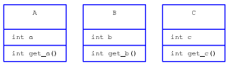
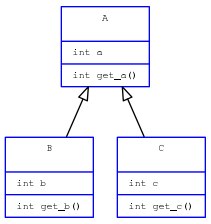
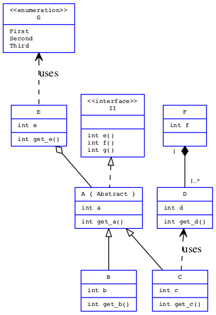

YAUML
~~~~~

A script for generating UML diagrams from `YAML <http://www.yaml.org/>`__ files.

Dependencies
============

To run the script, the following softwares are needed :

- Python 3;
- `PyYAML <https://bitbucket.org/xi/pyyaml>`__ (PyYAML for Python2 and Python3
  seem to be in conflict);
- `Graphviz <http://www.graphviz.org/>`__ (optional, but the whole point is to
  use it).

Example
=======

Basic example
-------------

The script uses the YAML syntax in order to build a UML class diagram. For
instance, consider the file ``./example/ex1/1.yaml`` whose content is::

    - class: A
      attributes:
        - int a
      methods:
        - int get_a()
    
    - class: B
      attributes:
        - int b
      methods:
        - int get_b()
    
    - class: C
      attributes:
        - int c
      methods:
        - int get_c()

Then enter the following command in a terminal::

    yauml ./example/ex1/1.yaml

The resulting output is a *dot* file on **stdout**, which is the syntax of
Graphviz files. If one prefers to obtain an image, **dot** has to process the
data going out from ``yauml`` like so::

    yauml ./example/ex1/1.yaml | dot -Tpng -o ./example/ex1/1.png

Equivalently, one might give Graphviz options to ``yauml`` which will be passed
to ``dot``::

    yauml -Tpng -o ./example/ex1/1.png ./example/ex1/1.yaml

Using the default template given with this program, the result after passing the
output to ``dot`` is:

More advanced options
---------------------

Other options can be added to the previous diagram::

    - class: A
      attributes:
        - int a
      methods:
        - int get_a()
    
    - class: B
      inherits:
        - A
      attributes:
        - int b
      methods:
        - int get_b()
    
    - class: C
      inherits:
        - A
      attributes:
        - int c
      methods:
        - int get_c()
    
In that case, the output would now be:

Supported options
-----------------

So far, YAUML handles:

- Classes (can be abstract)
    - Attributes
    - Methods
- Interfaces
- Enumerations
- Relations
    - Simple association
    - Inheritance
    - Use
    - Aggregation
    - Composition
    - Implement
- Relation multiplicity

These features are summarized in the more complete example below:

Documentation
=============

This comes with a manual explaining all you need to know to use this script. For
more information about the *dot* language and the the way to set up a template,
see **Graphviz** documentation.

Installation
============

Simply run::

    make install

To reinstall, type::

    make reinstall

Bash completion
===============

In order for TAB completion to be configured when you install the program, you
have to configure the ``BASH_COMPLETION_DIR`` variable in the ``Makefile``,
whose value depends on the OS you are using.

Versions
========

Versions from v0.1 until v1.0 are not claimed to be backwards compatible. Until
v1.0, the program may change strongly.
